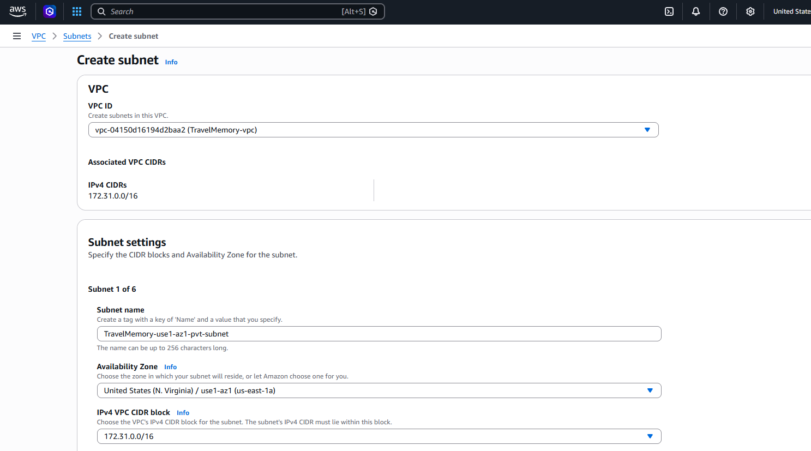
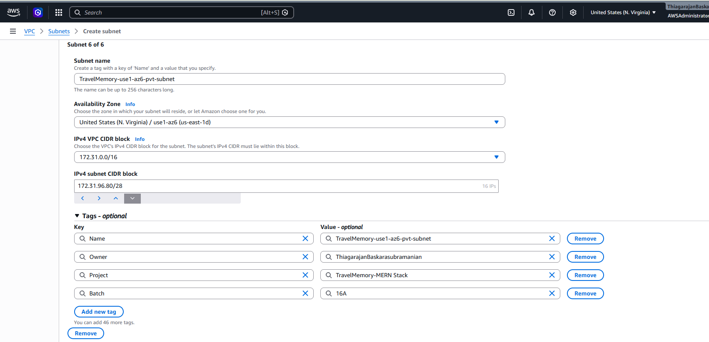
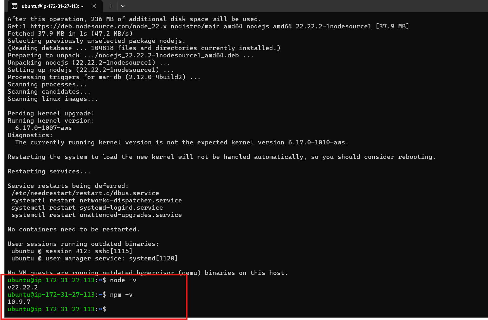
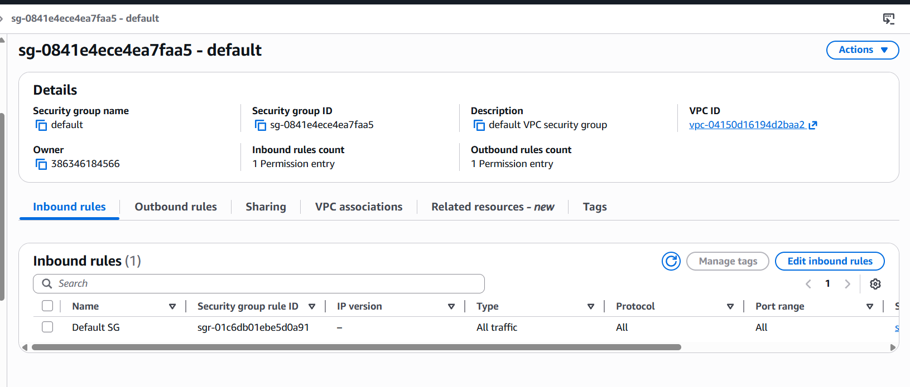
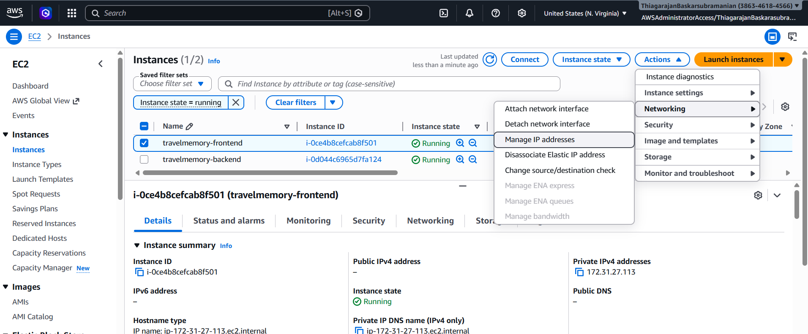
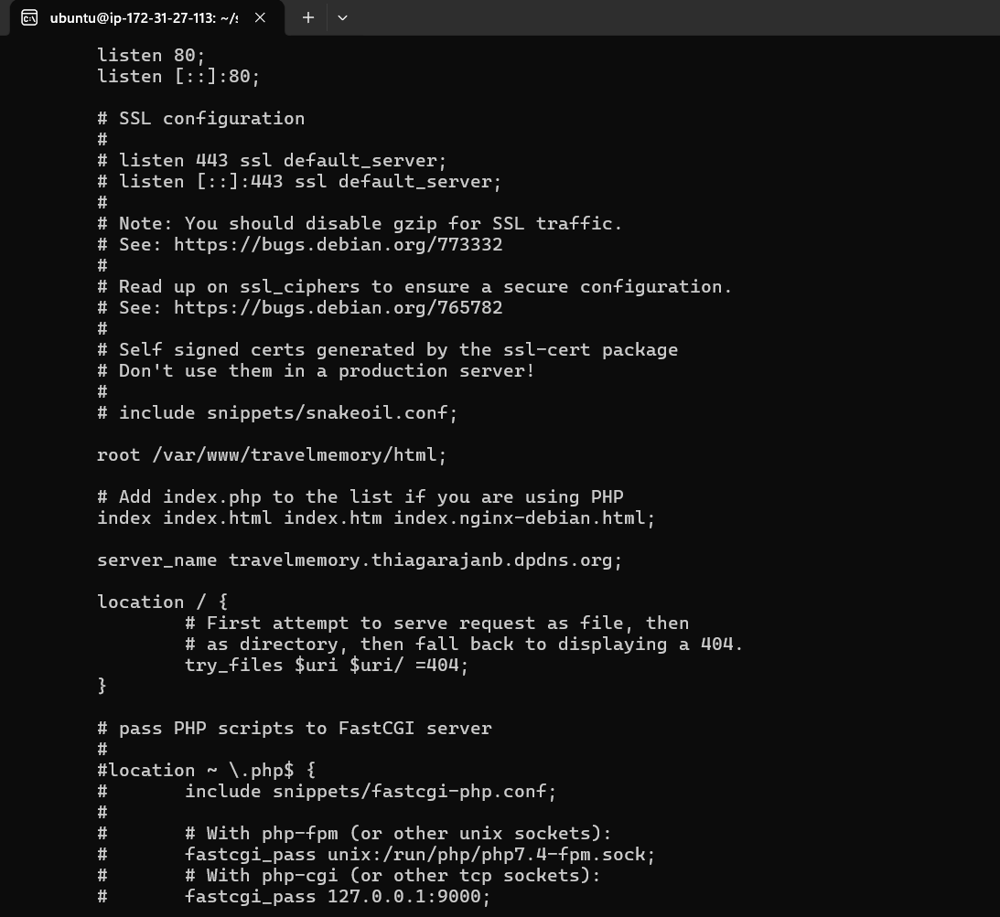
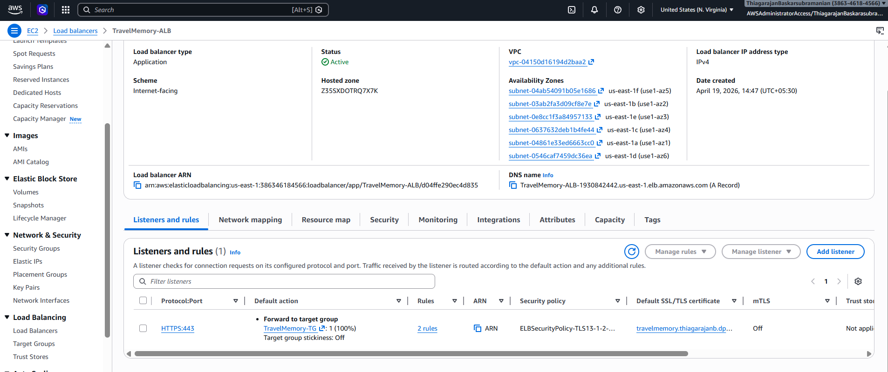
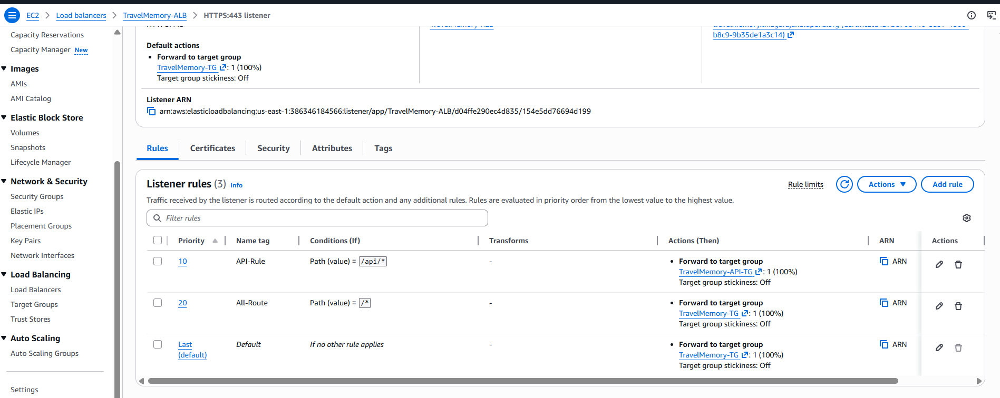

# TravelMemory: MERN Stack Deployment on AWS EC2 (Exhaustive Implementation Guide)

A comprehensive documentation of the end-to-end deployment of the **TravelMemory** application on AWS, demonstrating a highly available and secure 3-tier architecture with every implementation step verified.

---

## 📖 Table of Contents
- [About TravelMemory](#-about-travelmemory)
- [Core Features](#-core-features)
- [Deployment Quick-Start](#-deployment-quick-start)
- [🏗 Architecture Overview](#-architecture-overview)
- [🛠 Phase 1: Networking & Infrastructure](#-phase-1-networking--infrastructure-deep-dive)
- [🚀 Phase 2: Backend Infrastructure](#-phase-2-backend-infrastructure-nodejsubuntu)
- [🌐 Phase 3: Frontend & Reverse Proxy](#-phase-3-frontend--reverse-proxy-reactnginx)
- [⚖️ Phase 4: Load Balancing & DNS Integration](#-phase-4-load-balancing--dns-integration)
- [📊 Phase 5: Database & Live Application](#-phase-5-database--live-application)
- [📝 Key Learnings](#-key-learnings--implementation-highlights)

---

## 🌟 About TravelMemory
**TravelMemory** is a full-stack MERN (MongoDB, Express, React, Node.js) application designed for travel enthusiasts to document and cherish their journeys. It serves as a digital travel journal where users can store details about their trips, including the places they visited, the hotels they stayed at, and the unique experiences they had.

The application is built to be lightweight, responsive, and easy to use, providing a seamless way to preserve travel memories forever.

## ✨ Core Features
- **Experience Journal**: Capture detailed notes about your trips, including start/end dates and personal reflections.
- **Trip Categorization**: Organize memories by trip type, such as *Leisure*, *Backpacking*, or *Business*.
- **Expense Tracking**: Keep a record of the total cost associated with each journey.
- **Visual Memories**: Support for attaching images to each travel entry (via URL).
- **Featured Experiences**: Highlight specific trips on the homepage for quick access.
- **Responsive Design**: A user-friendly interface that works across various devices.

---

## 🛠 Deployment Quick-Start
To deploy this application for your own use, follow these high-level steps:

1.  **Cloud Infrastructure**: Set up a custom VPC with Public and Private subnets. Configure Security Groups to allow traffic on ports 80 (HTTP), 443 (HTTPS), and 3001 (Backend API).
2.  **Database**: Create a MongoDB Atlas cluster and obtain your connection string.
3.  **Backend Tier**: 
    - Launch an EC2 instance in the Private subnet.
    - Clone the repository and configure the `.env` file in the `backend/` directory with your `MONGO_URI` and `PORT=3001`.
    - Install dependencies and start the Node.js server (using PM2 for persistence).
4.  **Frontend Tier**: 
    - Launch an EC2 instance in the Public subnet.
    - Update `frontend/src/url.js` to point to your backend API.
    - Generate a production build (`npm run build`).
    - Configure Nginx as a reverse proxy to serve the build files and forward API requests.
5.  **Traffic Management**: 
    - Set up an Application Load Balancer (ALB) to distribute traffic.
    - Configure Target Groups and Health Checks.
6.  **Domain & Security**: 
    - Point your custom domain to the ALB DNS using Cloudflare (CNAME).
    - Provision an SSL certificate via AWS Certificate Manager (ACM) for HTTPS.

---

## 🏗 Architecture Overview

The deployment follows AWS best practices for security and scalability, utilizing a custom VPC, isolated Public/Private subnets, an Application Load Balancer, and Nginx as a reverse proxy.

---

## 🛠 Phase 1: Networking & Infrastructure Deep-Dive

### 1.1 Custom VPC & Subnet Architecture
The foundation is a dedicated VPC (`TravelMemory-vpc`) with a `172.31.0.0/16` CIDR. To ensure high availability, subnets were distributed across multiple Availability Zones.

| Step | Action | Reference Image |
| :--- | :--- | :--- |
| 1 | VPC Dashboard and CIDR Configuration |  |
| 2 | Subnet Segmentation (Public/Private) |  |

📸 <b>View Detailed Networking Sub-steps (VPC, IGW, Route Tables)</b>

> In this phase, I configured the Internet Gateway, attached it to the VPC, and established custom Route Tables for both Public and Private traffic flow.

| Action | Screenshot |
| :--- | :--- |
| **VPC Details** |  |
| **Subnet Creation and Associations** |        |
| **NAT Gateway Details** |  |
| **Route Table Details** |  |
| |  |
| |  |
| |  |
| |  |

### 1.2 Multi-Layer Security Grouping
I implemented a "least-privilege" traffic model using tiered security groups.

📸 <b>View Detailed Security Group Rules & Configuration</b>

| SG Name | Purpose | Configuration |
| :--- | :--- | :--- |
| `ALB-SG` | Internet Edge |  |
| `Frontend-SG` | Web Tier |  |
| `Backend-SG` | App Tier |  |

---

## 🚀 Phase 2: Backend Infrastructure (Node.js/Ubuntu)

### 2.1 Instance Launch & Environment
Launched an Ubuntu 24.04 server and configured the MERN backend environment.

📸 <b>View Detailed Backend Implementation (Provisioning & CLI)</b>

| Milestone | Action | Reference Image |
| :--- | :--- | :--- |
| **Instance Creation** | Provisioning the Ubuntu 24.04 `t2.micro` |  |
| **Terminal Connection** | Initial SSH and System Update |  |
| **Env Configuration** | Setting up `.env` with MongoDB URI |  |
| **Service Launch** | Starting the Node.js process on Port 3001 |  |
| **Connectivity Check** | Internal testing of the API endpoint |  |

---

## 🌐 Phase 3: Frontend & Reverse Proxy (React/Nginx)

### 3.1 Build and Nginx Setup
The React application was optimized for production and served via a hardened Nginx configuration.

| Step | Action | Configuration / Reference |
| :--- | :--- | :--- |
| 1 | Create Nginx configuration | [deployment/nginx/travelmemory.conf](./deployment/nginx/travelmemory.conf) |
| 2 | Enable configuration via symlink | `sudo ln -s /etc/nginx/sites-available/travelmemory.conf /etc/nginx/sites-enabled/` |
| 3 | Verification |  |

📸 <b>View Detailed Frontend & Nginx Sub-steps</b>

| Action | Screenshot |
| :--- | :--- |
| **Dependencies** | Running `npm install` for React |  |
| **Optimization** | Generating the Production Build |  |
| **Nginx Logic** | Configuring the Reverse Proxy Routes |  |
| **Service Status** | Verification of Nginx Active Status |  |

### 3.2 SSL/TLS Implementation
Security was reinforced by implementing SSL certificates via AWS Certificate Manager (ACM).

📸 <b>View Detailed SSL/ACM Configuration Steps</b>

| Step | Action | Reference Image |
| :--- | :--- | :--- |
| 1 | Certificate Request in ACM |  |
| 2 | DNS Validation in Cloudflare |  |
| 3 | Certificate Issued & Ready |  |
| 4 | HTTPS Listener Configuration |  |

---

## ⚖️ Phase 4: Load Balancing & DNS Integration

### 4.1 Application Load Balancer (ALB)
The ALB manages incoming traffic and performs continuous health monitoring of the frontend tier to ensure zero-downtime routing.

| Requirement | Target Group Setting | Description |
| :--- | :--- | :--- |
| **Protocol** | HTTP | Standard web traffic monitoring |
| **Path** | `/health` | Dedicated lightweight health endpoint |
| **Healthy Threshold** | 5 consecutive successes | Ensures instance is fully stabilized |
| **Unhealthy Threshold** | 2 consecutive failures | Rapidly removes failing nodes from rotation |
| **Timeout** | 5 seconds | Prevents slow responses from hanging the balancer |
| **Interval** | 30 seconds | Balanced check frequency for low overhead |
| **Success Codes** | 200 | Expects a standard HTTP OK response |

#### Health Endpoint Implementation
I implemented specific logic at each layer to respond to these ALB pings:
*   **Nginx Layer**: Returns a static `200 OK` via the `/health` location block.
*   **Node.js Layer**: A dedicated Express route returns `{ status: "OK" }` to verify the application process is alive.

📸 <b>View Exhaustive ALB Creation & Target Group Gallery</b>

> This gallery documents the full step-by-step ALB setup process.

| Phase | Description | Image |
| :--- | :--- | :--- |
| **ALB Creation** | Initial Load Balancer Config |  |
| **Network Config** | Selecting VPC and Subnets |  |
| **Target Groups** | Creating the `TravelMemory-TG` |  |
| **Registration** | Registering Frontend Targets |  |
| **Review** | Final validation before launch |  |
| **Active Status** | ALB Provisioning Complete |  |

### 4.2 Cloudflare DNS & Edge Integration
Connected the domain `thiagarajanb.dpdns.org` to the AWS infrastructure via Cloudflare.

📸 <b>View Cloudflare DNS & Analytics Gallery</b>

| Action | Screenshot |
| :--- | :--- |
| **CNAME Record** | Mapping Domain to ALB DNS |  |
| **Verification** | Successful DNS Propagation |  |
| **Edge Traffic** | Cloudflare Traffic Overview |  |

---

## 📊 Phase 5: Database & Live Application

### 5.1 MongoDB Atlas Connectivity
Configured the global database cluster and verified the connection from the backend EC2.

### 5.2 Final Application Verification
The application is fully functional and accessible via the custom domain with a valid SSL certificate.

**Homepage:**

**Detailed Experience View:**

---

## 📝 Key Learnings & Implementation Highlights

*   **Architecting Secure Networking**: Mastered the practical implementation of a custom AWS VPC, including subnet segmentation (Public/Private), Internet Gateway integration, and granular Route Table management to ensure a secure, multi-tier environment.
*   **Full-Lifecycle Load Balancing**: Gained hands-on experience in orchestrating Application Load Balancers (ALB), including Target Group management, advanced Listener rules, and the implementation of robust Health Check protocols for high-availability routing.
*   **SSL/TLS & Certificate Management**: Successfully navigated the end-to-end process of securing a web application by managing SSL termination at the ALB layer and utilizing AWS Certificate Manager (ACM) for centralized security.
*   **Network Security Maturity**: Demonstrated expertise in the "Least Privilege" security model by implementing tiered Security Groups (SGs) to strictly isolate traffic between the Edge (ALB), Web (Nginx), and Application (Node.js) layers.
*   **Managed DNS & Edge Integration**: Learned to bridge domain management with cloud infrastructure by configuring Cloudflare DNS, managing CNAME/A records, and verifying global propagation to connect a custom domain (`thiagarajanb.dpdns.org`).

---
*Developed and Deployed by Thiagarajan B.*
